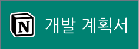

# 국군 야전 상황보고체계, ROK Situation Reporting System


<br/>

<div align="center">
<a href="https://nine-collision-c7a.notion.site/793f13ecb47a4a60b5fe6938802590ed?v=3795ace74cfa47c09bfc3e95008d2671"></a>&nbsp;&nbsp;<a href="https://rok-mabigmk4h-s3kim2018.vercel.app/"></a>&nbsp;&nbsp;<a href="https://github.com/osamhack2022-v2/WEB_APP_ROK-Situation-Reporting-System_ROK-SRS/wiki/%EC%95%94%ED%98%B8%EC%99%80-%EC%B2%B4%EA%B3%84"></a>
</div>

<br/>
<div align="center">
<h2>데모영상 시청</h2>
<a href="https://www.youtube.com/watch?v=4J2cPialaMY"></a>
</div>

<br/>

1. [프로젝트 소개](#introduction)
1. [기능 설명](#features)
1. [화면 설계](#functions)
1. [컴퓨터 구성 / 필수 조건 안내 (Prerequisites)](#requirements)
1. [기술 스택 (Technique Used) ](#techniques)
1. [설치 안내 (Installation Process) ](#installation)
1. [팀 정보 (Team Information) ](#team)
1. [문서 (Documentation)](#documentation)
1. [저작권 및 사용권 정보 (Copyleft / End User License) ](#copyright)

<a id = "introduction"></a>

## 📢 프로젝트 소개

<a id = "problem"></a>

**🚩 문제점**

> "7생활관 전원 코로나 걸렸대, 대대장님께 카톡으로 보고드려."

> "오늘 훈련한 거 사진 찍어서 대대 단톡방에 올려."

> "후임이 다쳤는데 군 전화도 주변에 없네… 어떻게 보고를 하지?"

> "밥이 너무 맛이 없는데 건의를 어떻게 하지? 연대장님께 전화해볼까?"

대대급 부대 내부에서 용사와 간부 또는 간부 대 간부 간 이용할 효율적이고 안전한 보고체계가 없습니다.

- 기존의 온나라 체계를 이용한다 하더라도 국방망에 접속이 불가능한 영외 간부에 대한 호출 및 긴급정비와 같은 상황일 경우, 전파에 어려움이 있어 전화/카카오톡과 같은 서비스를 이용하는 것이 현실입니다. 더불어 용사는 해당 체계 계정조차 생성할 수 없다는 것이 뚜렷한 한계점입니다.
- 부대 내부의 정보는 아무리 사소하더라도 군사기밀입니다. 민간 상용 애플리케이션을 이용하는 것은 사이버 보안에 위배되는 행위이고, 기밀 사항을 실수로 다른 사람에게 전달할 수 있는 위험성이 존재하며, 타사 애플리케이션이 해킹당하면 저장된 자료가 암호화되어있다는 보장도 없습니다. 또한, 사회공학으로 군사기밀이 유출될 위험도 있습니다.
- 보안성에 문제가 있을 뿐만 아니라, 군에서 원칙적으로 이행되어야 하는 보고체계를 준수하지 않고 보고하는 상황도 많이 발생합니다.
- 이런 문제점들은 군대라는 조직에서 통제능력 상실과, 상황조치에 큰 차질을 초래할 것입니다.

<a id = "solution"></a>

**💡 국군 야전 상황보고체계의 해결책**

- 부대 내의 모든 전파사항은 암호문 비구별성 원칙(IND-CPA)에 따라 암호화되며 무결성과 기밀성을 보장합니다.
- 케르크호프스의 원리에 따라서 키값이 노출되지 않는 한 보안성이 보장되어, 국군 보안사고를 원천 차단하는 것이 목표입니다.

- [x] 부대에서 긴급상황을 보고체계에 맞추어 보고할 수 있는 애플리케이션
- [x] 보고받은 상황을 암호와 하여 정보를 보호하는 애플리케이션

국군 야전 상황보고체계 (ROK Situation Reporting System)은 위에 나열된 문제에 대한 해결책이 될 것입니다.
상황이 상급 보고체계에 보고되기 전 각 부대 (여단, 대대, 독립중대) 지휘통제실에서 상황을 종합하고 지시사항을 하달하는 C4I 체계가 될 것입니다.


- 규정에 입각한 체계적인 보고체계를 준수하여 보고되어 상황조치 능력을 향상시킬 수 있다.
- 메모보고 기능으로 보고체계를 따르는 상황 보고를 올릴 수 있다.
- 채팅으로 긴급한 사항을 설명하고 추가 지시사항을 받을 수 있다.
- 저장된 부대 메모보고, 보고체계는 부대장이 관리하고 개선할 수 있다.
- 모든 보고사항은 암호와되며 기밀성과 무결성을 보장한다.

<a id = "market"></a>

**💸 목표 시장**

1. 독립중대, 대대, 단, 연대단위 군부대.
2. 군사경찰 부대.
3. 사령부 내부 부서/처.
4. 국정원, 경호원, 무기체계 개발팀 등 기밀 사항 연구 보직.

<a id = "features"></a>

## 📖 기능 설명

### 🔒 강력한 암호화

<table>
	<tr>
		<td align='center'>
			
		</td>
	</tr>
	<tr>
		<td align='center'><b>데이터베이스 객체 암호화</b></td>
	</tr>
	<tr>
		<td align='center' style = "text-align: center">
		대칭 암호화 체계를 이용해 데이터베이스 객체의 모든 항목을 암호화합니다. <br>
		암호화 키값은 키값 저장소에 안전하게 저장됩니다. 
		</td>
	</tr>
</table>

<table>
	<tr>
		<td align='center'>
			
		</td>
	</tr>
	<tr>
		<td align='center'><b>통신 암호화</b></td>
	</tr>
	<tr>
		<td align='center' style = "text-align: center">
		비대칭 암호화 체계를 이용해 군인들이 주고받는 메세지와 메모보고를 암호화합니다. <br>
		군인의 공개키값으로 통신 키를 암호화한 후, 군인이 비공개키값으로 키를 해독 할 수 있습니다. <br>
		암호화 키값은 키값 저장소에 안전하게 저장됩니다. 
		</td>
	</tr>
</table>

### 💥 AI를 통한 심각성/중요도 점수

<table>
	<tr>
		<td align='center'>
			
		</td>
	</tr>
	<tr>
		<td align='center'><b>AI가 보고사항에 대한 심각성/중요도 점수 파학</b></td>
	</tr>
	<tr>
		<td align='center' style = "text-align: center">
		명사와 동사를 감성분석기로 분석. <br>
		1~5 심각성/중요도 점수 반환 
		</td>
	</tr>
</table>

<a id="functions"></a>

### ⚙️화면 설계

<table>
	<tr>
		<td width="44%" style="text-align: center; font-size: 12pt; font-weight: bold;">데스크탑 화면</td>
		<td width="22%" style="text-align: center; font-size: 12pt; font-weight: bold;">모바일 화면</td>
		<td width="34%" style="text-align: center; font-size: 12pt; font-weight: bold;">기능 설명</td>
	</tr>
	<tr>
		<td>
		
		</td>
		<td>
		
		</td>
		<td>등록된 사용자의 로그인</td>
	</tr>
	<tr>
		<td></td>
		<td></td>
		<td>부대로부터 초대 코드를 받은 장병 회원가입</td>
	</tr>
	<tr>
		<td></td>
		<td></td>
		<td>자신의 유저 정보 / 부대 정보 / 메모 보고 확인</td>
	</tr>
	<tr>
		<td></td>
		<td></td>
		<td>같은 부대 내 장병들의 조직 체계 조회 화면</td>
	</tr>
	<tr>
		<td></td>
		<td></td>
		<td>조직도 내 장병의 세부 정보 확인<br/>권한에 따라 추가·수정·삭제</td>
	</tr>
	<tr>
		<td></td>
		<td></td>
		<td>보고 체계를 따르는 군 내 메모보고 조회 화면</td>
	</tr>
	<tr>
		<td></td>
		<td></td>
		<td>메모보고 업로드 화면</td>
	</tr>
	<tr>
		<td></td>
		<td></td>
		<td>채팅 페이지</td>
	</tr>
	<tr>
		<td></td>
		<td></td>
		<td>서비스 내에서 사용되는 유저의 정보 확인</td>
	</tr>
	<tr>
		<td></td>
		<td></td>
		<td>자신이 속한 부대 정보 조회 화면<br/>권한에 따라 추가·수정·삭제</td>
	</tr>
	<tr>
		<td></td>
		<td></td>
		<td>보고체계 리스트 화면<br/>권한에 따라 추가·수정·삭제</td>
	</tr>
</table>

### 프로젝트 사용법 (Getting Started)

[데모 영상](https://www.youtube.com/watch?v=4J2cPialaMY)

<a id = "requirements"></a>

## 💻컴퓨터 구성 / 필수 조건 안내

- ECMAScript 6 지원 브라우저 사용
- 권장: Google Chrome 버전 77 이상

<a id = "techniques"></a>

## 기술 스택 (Technique Used)

### Development Stack


### Web Frontend

  

### Mobile Frontend

 

### Backend

 

### Database

  

### Collaboration Tools


### Encryption Scheme

<table>
<tr>
	  <td align='center'>Logo</td>
	  <td align='center'>Name/Encryption Scheme</td>
	  <td align='center'>Purpose</td>
 </tr>
 <tr>
	  <td align='center'></td>
	  <td align='center'>RSA</td>
	  <td align='center'>비대칭 암호화 (암호화된 키 값 전송)</td>

 </tr>
  <tr>
	  <td align='center'></td>
	  	  <td align='center'>Crypto.js</td>
	  <td align='center'>대칭 암호화 기능 (AES, HMAC)</td>
 </tr>
   <tr>
	  <td align='center'></td>
	  	  <td align='center'>Azure Keystore</td>
	  <td align='center'>비밀 키 값 (Secret Key) 저장</td>
 </tr>
</table>

### Open Source(Library)

- cookies-next
- react-draggable
- react-firebase-hooks
- react-infinite-scroll-component
- react-organizational-chart
- crypto-js
- uuid
- jose

<a id = "installation"></a>

## 설치 안내 (Installation Process)

- Backend

```bash
$ git clone https://github.com/osamhack2022/WEB_APP_ROK-Situation-Reporting-System_ROK-SRS.git
$ cd back-end
$ npm install
.env 파일 생성 후
$ npm run start
```

<br/>
- Frontend(Web)
```bash
$ git clone https://github.com/osamhack2022/WEB_APP_ROK-Situation-Reporting-System_ROK-SRS.git
$ cd front-end/web
```
<br/>
- Frontend(App)
```bash
$ git clone https://github.com/osamhack2022/WEB_APP_ROK-Situation-Reporting-System_ROK-SRS.git
$ cd front-end/app
```
<a id="opensource"></a>
## 오픈소스

* mongoose
* jsonwebtoken
* bcryptjs
* cors
* classificator
* colors
* dotenv
* express-async-handler
* mongoose-encryption
* nodemon
* nodepapago
* socket.io
* wink-pos-tagger
* cookies-next
* react-draggable
* react-firebase-hooks
* react-infinite-scroll-component
* react-organizational-chart
* crypto-js
* uuid
* jose
* react-navigation
* react-native-paper
* react-native-async-storage
* react-native-dropdown-picker
* react-native-gifted-chat
* recoil


<a id = "installation"></a>

## APP 설치 안내 (App Installation Process)

```bash
Prerequisite: expo sign up

$ git clone https://github.com/osamhack2022-v2/WEB_APP_ROK-Situation-Reporting-System_ROK-SRS.git
$ cd front-end/app
$ npm install
$ npx eas build --profile preview

android 혹은 ios를 선택하여 build 진행 이후 .apk 파일을 본인의 스마트폰으로 이동하여 설치
```

## 프로젝트 사용법 (Getting Started)

**마크다운 문법을 이용하여 자유롭게 기재**

<a id = "team"></a>

## 팀 정보 (Team Information)

<table>
 <tr>
	  <td></td>
	  <td align='center'>이름</td>
	  <td align='center'>역할</td>
	  <td align='center'>GitHub</td>
	  <td align='center'>Contacts</td>
 </tr>
 <tr>
	  <td align='center'></td>
	  <td align='center'>김상영, 팀장</td>
	  <td align='center'>암호화</td>
	  <td align='center'><a href="https://github.com/s3kim2018"></a></td>
	  <td align='center'><a href="s3kim2018@berkeley.edu"></a></td>
 </tr>
 <tr>
	  <td align='center'></td>
	  <td align='center'>최윤성</td>
	  <td align='center'>프론트엔드(WEB)</td>
	  <td align='center'><a href="https://github.com/marunemo"></a></td>
	  <td align='center'><a href="chys3697@gmail.com"></a></td>
 </tr>
 <tr>
	<td align='center'></td>
  <td align='center'>김형민</td>
  <td align='center'>프론트엔드(APP) 개발자</td>
	<td align='center'><a href="https://github.com/gudmin0526"></a></td>
  <td align='center'><a href="gudmin0526@gmail.com"></a></td>
 </tr>
 <tr>
	  <td align='center'></td>
	  <td align='center'>조영효</td>
	  <td align='center'>백엔드</td>
	  <td align='center'><a href="https://github.com/yhcho0405"></a></td>
	  <td align='center'><a href="yhcho0405@kakao.com"></a></td>
 </tr>
</table>

<a id = "documentation"></a>

## 문서 (Documentation)

- [Backend Docs](https://github.com/osamhack2022-v2/WEB_APP_ROK-Situation-Reporting-System_ROK-SRS/wiki/Backend-Docs)
- [Git Commit Convention](https://github.com/osamhack2022-v2/WEB_APP_ROK-Situation-Reporting-System_ROK-SRS/wiki/Git-Commit-Convention)
  <a id = "copyright"></a>

## 저작권 및 사용권 정보 (Copyleft / End User License)

- [MIT](https://github.com/osamhack2022-v2/WEB_APP_ROK-Situation-Reporting-System_ROK-SRS/blob/main/LICENSE.md)

This project is licensed under the terms of the MIT license.
